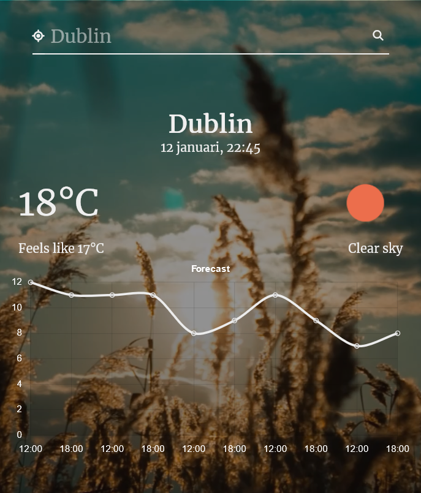

# weather
Weather app. School project: JavaScript @ IT-Högskolan
---

## Technologies
- JavaScript
- HTML
- CSS

## View the website live
[https://weather-app-native-javascript.netlify.app](https://weather-app-native-javascript.netlify.app)

## Description
A website that displays the current weather. Weather are fetched from [OpenWeather API](https://openweathermap.org/api) and the user gets to search for a city. The weather is presented in a simple line chart built with [Chart.js](chartjs.org/).

## Key Features
### Weather Search
One of the key features of my weather app is the ability for users to search for a specific city and view the current weather conditions. The weather data is fetched from OpenWeather API and presented to the user in a simple line chart built with Chart.js. The line chart allows users to easily view temperature over time, making it easy to understand the weather conditions. To search for a city, the user can enter the city name in the search bar and hit the search button, the weather data will be displayed in the chart.

### Current Location Weather
In addition to searching for a specific city, the weather app also allows users to view the weather for their current location by using the Geolocation API. This feature allows users to easily view the weather for their current location, without having to manually search for it.

## Project goals
- use fetch and display content dynamically.
- Handle user interaction with eventListeners.
- Visualize information using chart.js or similar libraries.

## Future improvements" 
- Video sizes are too big, needs a fix. Could use an image as background while video is loading.
